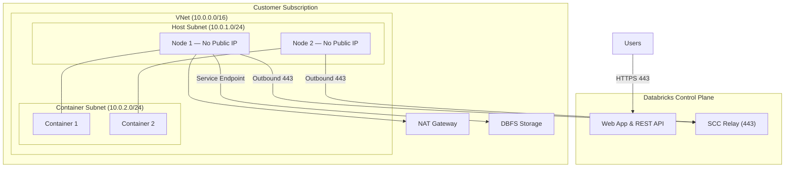

# Azure Databricks Secure Cluster Connectivity Demo

[](https://portal.azure.com/#create/Microsoft.Template/uri/https%3A%2F%2Fraw.githubusercontent.com%2Frtecho%2Fazure-databricks-scc-demo%2Fmaster%2Finfra%2Fmain.json)

A reusable, customer-ready demo package that showcases Azure Databricks Secure Cluster Connectivity (No Public IP / NPIP) with VNet injection, NAT Gateway egress, and optional Private Link integration.

---

## Repository Structure

```
azure-databricks-scc-demo/
├── README.md
├── infra/
│   ├── main.bicep
│   └── main.parameters.json
├── website/
│   ├── index.html
│   ├── why-scc.html
│   ├── architecture.html
│   ├── network-design.html
│   ├── deployment-guide.html
│   ├── comparison.html
│   ├── css/
│   │   └── layout.css
│   └── js/
│       └── app.js
├── docs/
│   └── architecture.md
└── .github/
    └── workflows/
        └── deploy-pages.yml
```

## Quick Start

### Option 1: Deploy to Azure (One-Click)

Click the **Deploy to Azure** button above. Parameters:

| Parameter | Description | Default |
|---|---|---|
| `location` | Azure region | resourceGroup().location |
| `workspaceName` | Databricks workspace name | `dbw-scc-demo` |
| `pricingTier` | Workspace tier | `premium` |
| `enableNoPublicIp` | Enable SCC (No Public IP) | `true` |
| `vnetAddressPrefix` | VNet CIDR | `10.0.0.0/16` |
| `hostSubnetPrefix` | Host subnet CIDR | `10.0.1.0/24` |
| `containerSubnetPrefix` | Container subnet CIDR | `10.0.2.0/24` |
| `privateEndpointSubnetPrefix` | PE subnet CIDR | `10.0.3.0/24` |
| `resourcePrefix` | Resource naming prefix | `dbwscc` |

### Option 2: Azure CLI

```bash
# Register provider
az provider register --namespace Microsoft.Databricks

# Create resource group
az group create --name rg-databricks-scc-demo --location southeastasia

# Deploy
az deployment group create \
  --resource-group rg-databricks-scc-demo \
  --template-file infra/main.bicep \
  --parameters infra/main.parameters.json
```

### Option 3: Bicep CLI

```bash
az bicep build --file infra/main.bicep --outfile infra/main.json
az deployment group create \
  --resource-group rg-databricks-scc-demo \
  --template-file infra/main.json
```

## What Gets Deployed

The Bicep template deploys:

- **VNet** (10.0.0.0/16) with three subnets:
  - Host subnet (10.0.1.0/24) — delegated to Microsoft.Databricks/workspaces
  - Container subnet (10.0.2.0/24) — delegated to Microsoft.Databricks/workspaces
  - Private endpoint subnet (10.0.3.0/24) — for optional Private Link
- **NSG** with Databricks-required outbound rules (auto-managed via delegation)
- **NAT Gateway** with Standard public IP for stable egress
- **Azure Databricks Workspace** (Premium tier) with:
  - Secure Cluster Connectivity enabled (enableNoPublicIp = true)
  - VNet injection into customer VNet
  - No public IPs on cluster nodes
  - No inbound ports (22, 5557) open

## Architecture



## Demo Website

The `website/` folder contains a static site deployed via GitHub Pages at:
**https://rtecho.github.io/azure-databricks-scc-demo/**

**Pages:**
- **Home** — What is Secure Cluster Connectivity
- **Why SCC** — Security, compliance, and operational benefits
- **Architecture** — Mermaid diagrams, data flow, control plane vs compute plane
- **Network Design** — VNet injection, NSG rules, Private Link, NAT Gateway
- **Deployment Guide** — Step-by-step with verification checklist
- **Comparison** — Default vs VNet Injection vs SCC vs SCC + Private Link

### Local Preview

```bash
cd website && python3 -m http.server 8080
```

## Key Concepts

| Concept | Description |
|---|---|
| **Secure Cluster Connectivity (SCC)** | Cluster nodes have no public IPs. Communication via outbound relay on port 443 |
| **VNet Injection** | Databricks compute runs in customer's own VNet |
| **SCC Relay** | Outbound HTTPS tunnel from cluster to control plane |
| **NAT Gateway** | Provides stable egress IP for VNet injection + SCC |
| **Private Link** | Optional — privatize workspace access (front-end) and/or control plane path (back-end) |
| **enableNoPublicIp** | The Bicep/ARM parameter that enables SCC (true by default since API 2024-05-01) |

## Cleanup

```bash
az group delete --name rg-databricks-scc-demo --yes --no-wait
```

## Prerequisites

- Azure subscription with Contributor role
- Azure CLI 2.50+ with Bicep extension
- Resource provider registered: `az provider register --namespace Microsoft.Databricks`
- Premium tier recommended for full Private Link support

## License

This demo package is provided as-is for demonstration and educational purposes.
