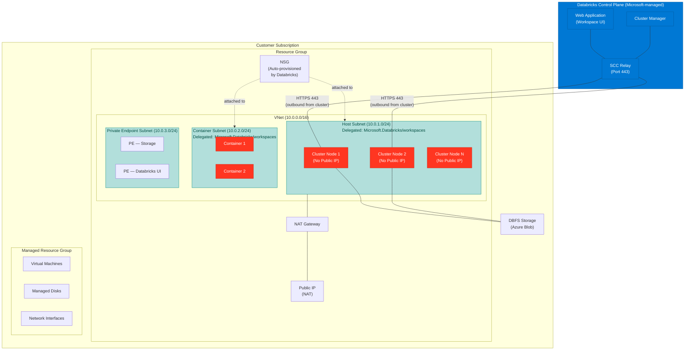

# Azure Databricks SCC Demo — Architecture

This document describes the architecture of the Azure Databricks Secure Cluster Connectivity (SCC) demo, including network topology, data flow, security rules, and key design decisions.

---

## Architecture Diagram

---

## Data Flow

The following numbered steps describe how data and control commands flow through the SCC architecture.

1. **User access via HTTPS to control plane** — The user opens the Databricks workspace URL in a browser. The request is served by the Databricks Web Application in the control plane over HTTPS (port 443). Authentication is handled via Azure AD / Entra ID.

2. **Cluster creation** — When a user requests a cluster, the Cluster Manager provisions VMs inside the customer's VNet. All cluster nodes are created in the Host Subnet (10.0.1.0/24) with **private IPs only** — no public IP addresses are assigned (`enableNoPublicIp = true`).

3. **Relay connection** — Once provisioned, each cluster node initiates an **outbound** HTTPS connection (port 443) to the Databricks SCC Relay in the control plane. This is a long-lived tunnel originating from the customer VNet, meaning no inbound ports need to be opened on the NSG.

4. **Command tunnel** — The control plane sends Spark commands, notebook instructions, and management signals to the cluster nodes through the established relay tunnel. Because the connection is outbound-initiated, the customer network remains fully protected from inbound access.

5. **Data access** — Cluster nodes read from and write to data sources such as Azure Data Lake Storage (ADLS) and Azure SQL via service endpoints or private endpoints. DBFS traffic flows to the backing Azure Blob Storage account over HTTPS (port 443).

6. **Egress** — Any internet-bound traffic from the cluster nodes is routed through the NAT Gateway, which provides a stable, predictable public IP for egress. This simplifies firewall allow-listing on downstream services.

---

## Network Security Model

With Secure Cluster Connectivity enabled, Databricks auto-provisions an NSG attached to both the Host and Container subnets. The following table summarizes the key rules.

| Direction | Protocol | Source | Destination | Ports | Purpose |
|-----------|----------|--------|-------------|-------|---------|
| Inbound | Any | VirtualNetwork | VirtualNetwork | Any | Internal cluster-to-cluster traffic |
| Outbound | TCP | VirtualNetwork | AzureDatabricks | 443, 3306, 8443-8451 | Control plane connectivity and SCC relay |
| Outbound | TCP | VirtualNetwork | Sql | 3306 | Hive metastore access |
| Outbound | TCP | VirtualNetwork | Storage | 443 | DBFS, artifacts, and log storage |
| Outbound | Any | VirtualNetwork | VirtualNetwork | Any | Cluster-internal communication |
| Outbound | TCP | VirtualNetwork | EventHub | 9093 | Log delivery (diagnostic logs) |

> **Note:** With SCC enabled, there are **NO** inbound rules for ports **22** (SSH) or **5557** (worker communication). All control plane-to-cluster communication is handled through the outbound-initiated SCC relay tunnel. This eliminates the need to open any inbound ports on the customer's NSG, significantly reducing the attack surface.

---

## Private Link Integration

Azure Databricks supports three types of Private Link connections, each addressing a different connectivity path.

### Inbound Private Link (Front-End)

Front-end Private Link secures the connection between users and the Databricks workspace UI/API. Two private endpoints are required:

- **`databricks_ui_api`** — Handles workspace REST API calls and web UI traffic. This endpoint is created in the customer's VNet (typically in the Private Endpoint Subnet) and provides a private IP for accessing the workspace.
- **`browser_authentication`** — Handles the Azure AD / Entra ID authentication redirect flow. A separate endpoint is needed because the authentication callback must resolve to a private IP within the customer's network.

With both endpoints in place, users access the Databricks workspace entirely over private connectivity — no traffic traverses the public internet.

### Classic Private Link (Back-End)

Back-end Private Link (also called "classic" Private Link) secures the connection between the Databricks control plane and the cluster nodes in the customer VNet. Instead of relying on the public SCC relay, the control plane communicates with cluster nodes over an Azure Private Link connection. This provides:

- End-to-end private connectivity for the control channel
- No dependency on public endpoints for cluster management
- Suitability for highly regulated environments that prohibit any public network path

### Outbound Private Link (Serverless)

Outbound Private Link uses **Network Connectivity Config (NCC)** to create private endpoints from Databricks serverless compute to customer-managed resources (e.g., ADLS Gen2 accounts, Azure SQL databases, Azure Event Hubs). Key characteristics:

- Managed by Databricks through the NCC framework
- Supports serverless SQL warehouses and Model Serving endpoints
- Private endpoints are provisioned in a Databricks-managed VNet and connect to the customer's resources
- Eliminates the need for the customer to manage additional networking infrastructure for serverless workloads

---

## Key Design Decisions

| Decision | Rationale |
|----------|-----------|
| **Premium tier required for Private Link** | Private Link features (front-end, back-end, and NCC-based outbound) are only available on the Databricks Premium pricing tier. The Standard tier does not support Private Link integration. |
| **NAT Gateway recommended for stable egress** | A NAT Gateway provides a fixed, predictable outbound public IP address. This simplifies IP allow-listing on external firewalls and avoids reliance on ephemeral public IPs. Without a NAT Gateway, outbound traffic uses Azure default SNAT, which can be unreliable at scale. |
| **Subnet delegation is mandatory** | Both the Host Subnet and Container Subnet must be delegated to `Microsoft.Databricks/workspaces`. This delegation grants the Databricks resource provider permission to inject cluster VMs and containers into those subnets and is enforced at deployment time. |
| **Minimum /26 subnets (/24 recommended)** | Each subnet must be at least /26 (64 addresses) to accommodate cluster nodes and overhead. A /24 (256 addresses) is recommended for production workloads to allow room for auto-scaling and concurrent clusters without IP exhaustion. |
| **`enableNoPublicIp = true` is the SCC toggle** | Setting the `enableNoPublicIp` parameter to `true` on the Databricks workspace resource activates Secure Cluster Connectivity. This single flag ensures all cluster nodes are deployed without public IP addresses, forcing all control-plane communication through the SCC relay. |
| **After March 31, 2026, new VNets require explicit outbound connectivity** | Azure is retiring default outbound access for VMs. New VNets created after March 31, 2026 will no longer have implicit outbound internet connectivity. Databricks deployments must explicitly configure a NAT Gateway, Azure Firewall, or User-Defined Routes (UDR) to ensure cluster nodes can reach the SCC relay and other required endpoints. |
